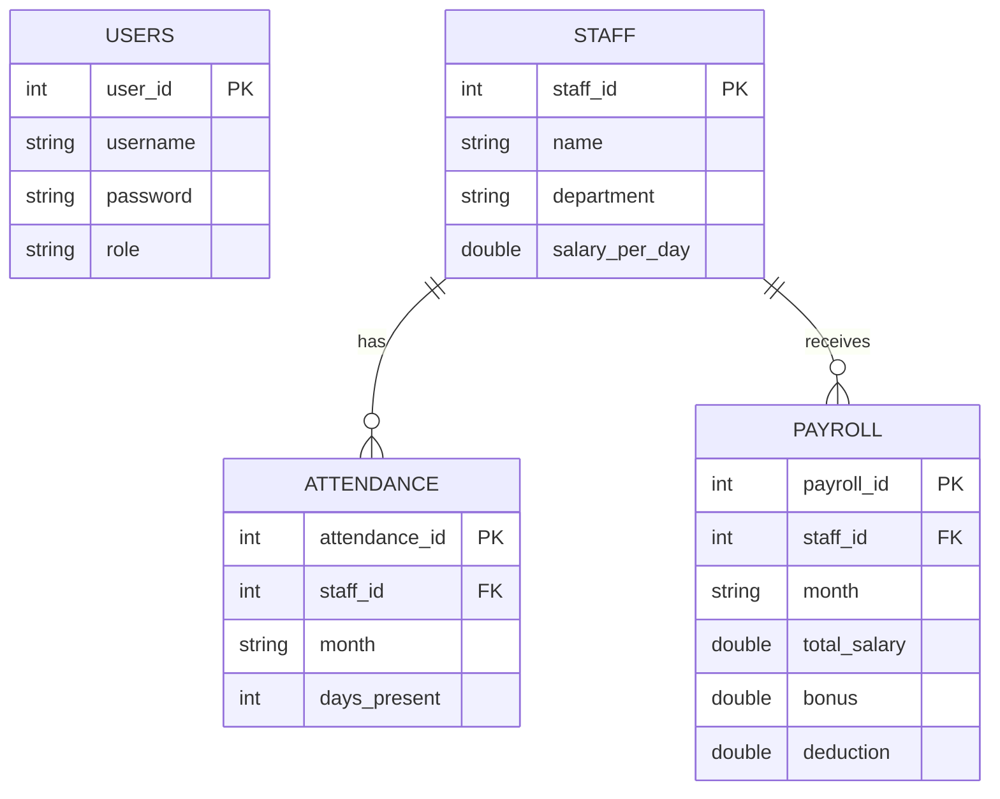
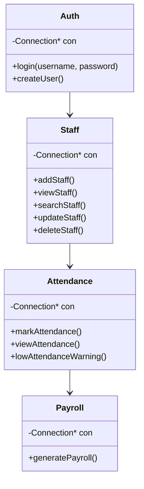

#  Smart Staff Attendance & Payroll Management System


A professional C++ and MySQL-based payroll management system designed to automate employee attendance tracking, salary processing, and administrative staff management.

---

#  Project Overview

The Smart Staff Attendance & Payroll Management System is developed to solve challenges related to manual payroll calculation and attendance management in organizations.

The system integrates:

- Employee management
- Attendance tracking
- Automated payroll generation
- Admin-controlled authentication
- Database management using MySQL

This project demonstrates real-world software engineering concepts including modular programming, database integration, authentication systems, and object-oriented programming using C++.

---

#  Key Features

## 👨‍💼 Staff Management
- Add new staff
- Update employee records
- Delete staff
- Search employees

## 📅 Attendance Management
- Record monthly attendance
- View attendance reports
- Low attendance warning system

## 💰 Payroll Management
- Automatic salary calculation
- Bonus and deduction handling
- Payroll report generation

## 🔐 Authentication System
- Secure login system
- Admin-controlled user creation
- Role-based access concept

## 🗄️ Database Integration
- MySQL relational database
- Structured data storage
- Foreign key relationships

---

#  Technologies Used

| Technology | Purpose |
|---|---|
| C++ | Core application logic |
| MySQL | Database management |
| MySQL Connector/C++ | Database connection |
| Git & GitHub | Version control |
| Linux Mint | Development environment |

---

#  System Architecture

```text
        USER
          ↓
   LOGIN SYSTEM
          ↓
   C++ APPLICATION
          ↓
 BUSINESS LOGIC LAYER
(Staff / Attendance / Payroll)
          ↓
      MYSQL DATABASE
```

---

#  Database Structure

## Tables Used

### 1. Users Table
Stores system login accounts:
- Username
- Password
- Role

### 2. Staff Table
Stores employee information:
- Staff ID
- Name
- Salary per day

### 3. Attendance Table
Stores attendance records:
- Staff ID
- Month
- Days present

### 4. Payroll Table
Stores payroll information:
- Bonus
- Deduction
- Total salary

---

# 🧩 Entity Relationship Diagram (ERD)



# 🏗️ UML Class Diagram



#  Database Tables

| Table Name | Description |
|---|---|
| users | Stores system login accounts and roles |
| staff | Stores employee information |
| attendance | Stores employee attendance records |
| payroll | Stores payroll and salary information |

---

##  Users Table

| Column | Type | Description |
|---|---|---|
| user_id | INT | Primary Key |
| username | VARCHAR | Login username |
| password | VARCHAR | User password |
| role | VARCHAR | Admin or HR role |

---

##  Staff Table

| Column | Type | Description |
|---|---|---|
| staff_id | INT | Primary Key |
| name | VARCHAR | Employee name |
| department | VARCHAR | Employee department |
| salary_per_day | DOUBLE | Daily salary |

---

##  Attendance Table

| Column | Type | Description |
|---|---|---|
| attendance_id | INT | Primary Key |
| staff_id | INT | Foreign Key |
| month | VARCHAR | Attendance month |
| days_present | INT | Number of days attended |

---

##  Payroll Table

| Column | Type | Description |
|---|---|---|
| payroll_id | INT | Primary Key |
| staff_id | INT | Foreign Key |
| month | VARCHAR | Payroll month |
| total_salary | DOUBLE | Final salary |
| bonus | DOUBLE | Additional bonus |
| deduction | DOUBLE | Salary deduction |


#  Installation & Execution

## 1️ Clone Repository

```bash
git clone https://github.com/HUNDEX-create/SmartPayrollSystem.git
```

---

## 2️ Open Project Folder

```bash
cd SmartPayrollSystem
```

---

## 3️ Compile Project

```bash
g++ src/main.cpp src/staff.cpp src/attendance.cpp src/payroll.cpp src/auth.cpp -o payroll_app -lmysqlcppconn
```

---

## 4️ Run Application

```bash
./payroll_app
```

---

#  Default Admin Login

```text
Username: admin
Password: admin123
```

---

#  Learning Outcomes

This project helped us understand:

- Object-Oriented Programming in C++
- Database integration with MySQL
- Authentication systems
- Modular software architecture
- CRUD operations
- Payroll automation logic
- GitHub collaboration workflow

---

#  Future Improvements

- GUI/Desktop version
- Password encryption
- PDF payroll reports
- CSV export functionality
- Web-based dashboard
- Analytics and visualization

---

#  Group Members

| Name | ID |
|---|---|
| Hundaol Begna | ETS0756/17 |
| Isaac Assefa | ETS0766/17 |
| Gemmachu Fikadu | ETS0628/17 |
| Ifa Silashi | ETS0764/17 |
| Gurmesa Borena | ETS0661/17 |

---

# 📚 Academic Purpose

This project was developed for educational purposes to demonstrate practical implementation of database-driven software systems using C++ and MySQL.

---

# ⭐ GitHub Repository

Developed and maintained using Git & GitHub workflow management.
